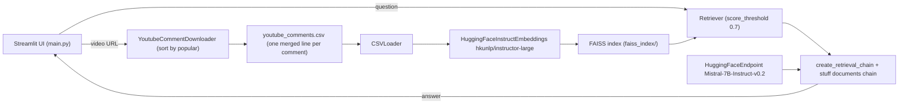

# Youtube-Comment-RAG — chatbot over the comments of a YouTube video

CHATBOT to extract data from youtube comments of provided youtube video link and answer queries related
to the comments (chatgpt can't do this).

Paste a video link, click "Create Knowledgebase", then ask questions such as which comment has the most
likes or what people are saying about a topic. Comments are downloaded, embedded into a FAISS index and
answered by a retrieval-augmented LLM chain built with LangChain.

## What it does

- `main.py` — Streamlit UI: title, "Create Knowledgebase" button, video-link input, question input,
  shows `response["answer"]`.
- `langchain_helper.py`
  - `create_vector_db(url)` downloads comments with `youtube_comment_downloader`
    (sorted by popular), writes each as one merged line
    (`comment is '...' with likes= N with user_id '...' and published(time) '...'`) to
    `youtube_comments.csv`, loads it with `CSVLoader`, embeds with
    `HuggingFaceInstructEmbeddings("hkunlp/instructor-large")` and saves a FAISS index to `faiss_index/`.
  - `get_qa_chain()` loads the index, builds a retriever (`score_threshold=0.7`), and a
    `create_retrieval_chain` over `create_stuff_documents_chain` with a
    `HuggingFaceEndpoint` LLM (`mistralai/Mistral-7B-Instruct-v0.2`). The system prompt explains the
    merged-comment format so the model can read likes, user id and time.
- `emoji_remove.py` — standalone helper that strips emoji from a `Comment Text` column and writes
  `cleaned_file.csv`; it is not called by the app.

## How it works



## Project structure

```
main.py                 Streamlit app
langchain_helper.py     comment download, FAISS index build, QA chain
emoji_remove.py         optional emoji cleaning script (unused by the app)
requirments.txt         dependencies (sic)
youtube_comments.csv    sample output: 74 comments from a One Piece video
faiss_index/            saved FAISS index for that sample
LICENSE                 MIT
```

## Getting started

```bash
pip install -r requirments.txt
pip install langchain_huggingface emoji   # imported but missing from requirments.txt
export HUGGINGFACEHUB_API_TOKEN=...       # required: read at import time
export GOOGLE_API_KEY=...                 # read, but the Gemini line needs `apikey` (see below)
streamlit run main.py
```

Before running, fix two hard-coded paths in `langchain_helper.py` and `emoji_remove.py`
(`H:\data science roadmap\langchain\youtubeproj\youtube_comments.csv`) to a relative
`youtube_comments.csv`.

## Status and limitations

- `langchain_helper.py` line `llm = ChatGoogleGenerativeAI(..., google_api_key=apikey)` references an
  undefined `apikey` at import time; the Gemini model is not used afterwards (the chain uses the
  HuggingFace endpoint), so this line has to be removed or fixed for the module to import.
- `requirments.txt` lists packages that the code does not use (groq, PyPDF2, pypdf,
  google-cloud-aiplatform) and misses `langchain_huggingface` and `emoji`.
- The instructor-large embedding model is downloaded on first run.
- No tests.

## License

MIT — see `LICENSE`.
